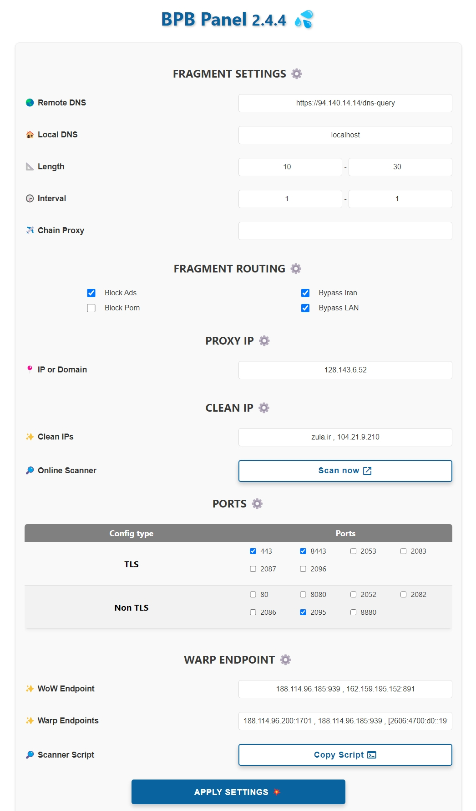

<h1 align="center">💦 BPB အကန့်</h1>

### 🌏 Readme in [English](README.md)

  

 

## နိဒါန်း
ဤပရောဂျက်သည် [Cloudflare-workers/pages proxy script](https://github.com/yonggekkk/Cloudflare-workers-pages-vless) [yonggekkk](https://github) အတွက် အသုံးပြုသူအကန့်ကို တီထွင်ထုတ်လုပ်ရန် ရည်ရွယ်ပါသည်။ .com/yonggekkk). အကန့်တွင် ဖြန့်ကျက်ရွေးချယ်စရာနှစ်ခု ပေးသည်- 
- **အလုပ်သမား** ဖြန့်ကျက်ခြင်း။
- **စာမျက်နှာများ** ဖြန့်ကျက်ခြင်း။
 

🌟 **BPB Panel** သည် အဖိုးတန်သည်ကို တွေ့ရှိပါက၊ သင်၏လှူဒါန်းမှုများသည် ကွဲပြားခြားနားမှုအားလုံးကို ဖြစ်စေသည်။
- **USDT (BEP20):** `0x111EFF917E7cf4b0BfC99Edffd8F1AbC2b23d158`

## အင်္ဂါရပ်များ

1. **အခမဲ့**- ကုန်ကျစရိတ် မပါဝင်ပါ။
2. **အသုံးပြုရလွယ်ကူသော အကန့်-** လွယ်ကူသော လမ်းညွှန်မှု၊ ဖွဲ့စည်းမှုနှင့် အသုံးပြုမှုအတွက် ဒီဇိုင်းထုတ်ထားသည်။
3. **ပံ့ပိုးမှုအပိုင်းအစ-** အပိုင်းပိုင်းလုပ်ဆောင်နိုင်စွမ်းအတွက် ပံ့ပိုးမှုပေးသည်။
4. **ကြော်ငြာများကိုပိတ်ဆို့ပါ။ နှင့် Porn (ချန်လှပ်ထားနိုင်သည်)**
5. **အီရန်နှင့် LAN ကို ရှောင်ကွင်း (ချန်လှပ်ထားနိုင်သည်)**
6. **လမ်းကြောင်းအပြည့်အစုံ-** အီရန်ကိုကျော်ဖြတ်ခြင်း၊ ကြော်ငြာများပိတ်ဆို့ခြင်း၊ Malwares၊ Phishing... Sing-box အတွက်။
7. **Chain Proxy:** IP ကိုပြင်ရန် ကွင်းဆက်ပရောက်စီကို ပေါင်းထည့်နိုင်သည်။
8. **ဖောက်သည်အမြောက်အမြားကို ပံ့ပိုးပေးသည်-** Xray နှင့် Sing-box core clients များအတွက် စာရင်းသွင်းလင့်ခ်များကို ကမ်းလှမ်းသည်။
9. **စာရင်းသွင်းခြင်းလင့်ခ် (JSON):** JSON configs အတွက် စာရင်းသွင်းခြင်းလင့်ခ်ကို ပေးသည်။
10. **Password-Protected Panel-** စကားဝှက်ကာကွယ်မှုဖြင့် သင့် panel ကို လုံခြုံအောင်ထားပါ။
11. **စိတ်ကြိုက် Cloudflare သန့်ရှင်းမှု IP-** အွန်လိုင်းစကင်နာကို အသုံးပြု၍ သန့်ရှင်းသော IP-ဒိုမိန်းများကို သတ်မှတ်ခြင်း စွမ်းရည်။
12. **Warp configs:** Warp စာရင်းသွင်းမှုတွင် Warp နှင့် Warp ပေးပါသည်။
 

##အသုံးပြုနည်း
- [တပ်ဆင်ခြင်း (စာမျက်နှာများ)](docs/pages_installation_fa.md)

- [တပ်ဆင်ခြင်း (အလုပ်သမား)](docs/worker_installation_fa.md)

- [အသုံးပြုနည်း](docs/configuration_fa.md)

- [FAQ](docs/faq.md)
 

## ပံ့ပိုးထားသောဖောက်သည်များ
| ဖောက်သည် | ဗားရှင်း | တစ်ပိုင်းတစ်စ |
| :-------------: | :-------------: | :-------------: |
| **v2rayNG** | 1.8.19 နှင့်အထက် | :heavy_check_mark: |
| **v2rayN** | 6.42 နှင့်အထက် | :heavy_check_mark: |
| **Nekobox** |   | :x: |
| **Sing-box** | 1.8.10 နှင့်အထက် | :x: |
| **Streisand** |   | :heavy_check_mark: |
| **V2Box** |   | :x: |
| **Shadowrocket** |   | :x: |
| **Nekoray** |   | :heavy_check_mark: |
| **Hiddify** |   | :x: |

---

## အချိန်နှင့်အမျှ Stargazers

---
